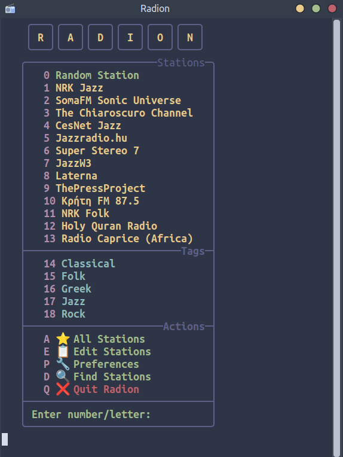
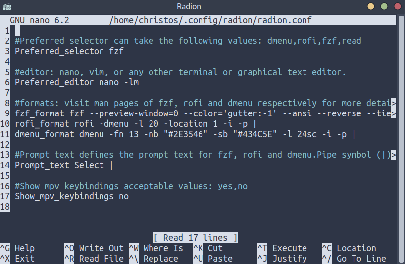
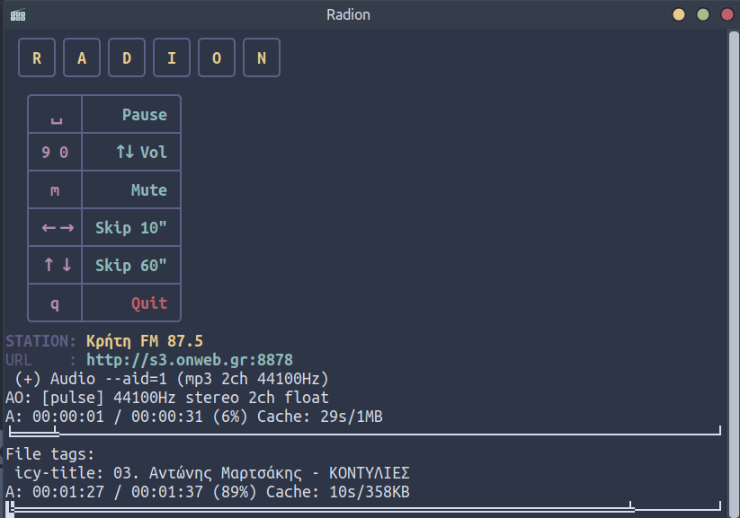

# radion

**radion** is an internet radio CLI client, written in Bash, for **Gnu/Linux and MacOS**.



Radion can be costumized as far as the station selecting program is concerned. The user can choose between:

- **read**
- **fzf**
- **rofi**
- **dmenu**

Through the main menu, the user can :

- Select a **tag** to pick a station from


- Select directly  a  **Favorite Station**.

- **Edit Stations** and their tags, by editing the specific file:


- **Configure Preferences**, by editing the .conf file:



- **Find new Stations**, visiting [https://www.radio-browser.info/](https://www.radio-browser.info/)

- **Quit Radion**.

---
## Adding a Station

In order to **add a station to radion**, the user edits the `$HOME/.cache/radion/stations.txt` file, either within radion, or through any text editor.
**The format of the line should be the following**:

`station-url ~Name-of-the-Station~ #Tag1 #Tag2 #Tag3`

- The `station-url` should go first.
- `Name of the Station` should come next, between **tildes** `~`, and whitespaces substituted by **hyphen** `-`
- Finally, tags come next, starting with **number sign** `#`. There can be as many tags in a line as the user likes.
-  The **`#Favorites` tag** adds the station to the **Favorites**.

- Adding empty lines to the file has no repercussions to the functionality. Separating lines to groups is also done only for demonstative purposes. To comment out a line, **add `//` at the beginning**.

---
## Configuring radion (Preferences option)

As mentioned above, selecting the `Preferences option` (or editing `$HOME/.config/radion/radion.conf` file using any text editor), the user can set the following preferences:

- **Preferred selector**. Acceptable values: `read`, `fzf`, `rofi`, `dmenu`.
- **Preferred editor**. Acceptable values can be `vim`, `nano`, `gedit`, `xed` or any other terminal or graphical text editor command **+ any flags**. For further info, visiting the respectable command `man` pages is  recommended.
- **fzf format, dmenu format, rofi format**: Here the `fzf`,  `dmenu` and `rofi` command string can be configured. If the user is not sure they know what they are doing, they are advised to **leave these variables alone**. At any rate, visiting the respectable command `man` page is **highly recommended**. Also, **pipe symbols** `|` are not to be ignored, they stand for the end of the string.
- **Prompt text**. Prompt text defines the **prompt text for fzf, rofi and dmenu.Pipe symbol** `|` is not to be ignored, stands for the end of the string.
- **Show mpv keybindings**. Acceptable values: yes no. This variable toggles the appearence of a little **mpv keybinding cheatsheet**:


---


## Dependencies

The principal dependency is the almighty [mpv](https://mpv.io/)

**Debian based linux**:

```
sudo apt install mpv
```

**macOS**:

```
brew install mpv
```

**Radion** can function with no other dependencies, however, the user can install [fzf](https://github.com/junegunn/fzf), [rofi](https://github.com/davatorium/rofi) or [dmenu](https://tools.suckless.org/dmenu/), according to their preference.


## INSTALL

- Open a terminal window and run:

```
git clone https://gitlab.com/christosangel/radion/
```

- Change directory to `radion/`, make `radion.sh` executable:

```
cd radion/

chmod +x radion.sh
```

- Create the necessary directories & files:

```
mkdir ~/.cache/radion/

mkdir ~/.config/radion/

cp stations.txt ~/.cache/radion/

cp radion.conf ~/.config/radion/

cp -r png/  ~/.cache/radion/
```

-Add `radion.sh` to the `PATH`:

```
cp radion.sh ~/.local/bin/
```
You are ready to go!

---

## Run

from any directory, run the command:

```
radion.sh
```


The mpv player is controlled with the mpv defined keybindings.

The user can also create a launcher using one of the images from the `png/` directory:


***Enjoy!***

---
**Disclaimer**: No responsibility is taken regarding the stations, their content, status or whether they are operational or not. Their presence in the `stations.txt` is exclusively demonstrative, represent nobody's taste, nationality, affiliations or orientation, what is more the user is expected to populate this file with stations of their preference.

---
