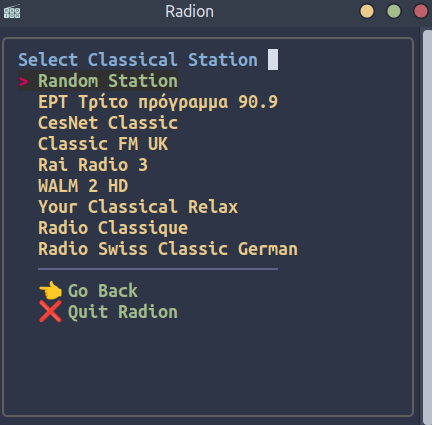
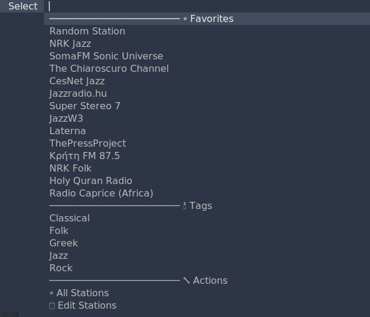

# radion

**radion** is an internet radio CLI client, written in Bash, for **Gnu/Linux and MacOS**.

{width=450}

Radion can be costumized as far as the station selecting program is concerned. The user can choose between:

- **read**
- **fzf**
- **rofi**
- **dmenu**

Through the menus, the user can :

- Select directly  a  **Favorite Station**.

- Select a **random station**.

- Select a **tag** to pick a station from




- **Edit Stations** and their tags, by editing the specific file:

{width=500}

- **Configure Preferences**, by editing the .conf file:

{width=500}

- **Find new Stations**, visiting [https://www.radio-browser.info/](https://www.radio-browser.info/)

- **❌ Quit Radion**.

---
## Finding a New Station

- Selecting the option **🔎 Find Stations**, the user is directed to  [https://www.radio-browser.info/](https://www.radio-browser.info/).

- There the user can search and find one or more stations that fit their particular and personal taste, e.g. :

{width=500}

- Clicking on this station, the user is directed to a page with the station's specific details. From all this data, the user picks the **station's url**:

{width=500}

The user should use **this url** while he adds a new line with this station's data to `$HOME/.config/radion/stations.txt`, selecting the **📋 Edit Stations** option.


---
## Adding a Station to Radion

In order to **add a station to radion**, the user edits the `$HOME/.config/radion/stations.txt` file, either within radion (**📋 Edit Stations**), or through any text editor.

**The format of the line should be the following**:

`station-url  ~Name-of-the-Station~ #Tag1 #Tag2 #Tag3`

for instance:

`https://lyd.nrk.no/nrk_radio_jazz_mp3_h ~NRK-Jazz~ #Jazz #Favorites`

- The `station-url` should go first: `https://lyd.nrk.no/nrk_radio_jazz_mp3_h`
- `Name of the Station` should come next, between **tildes** `~`, and whitespaces substituted by **hyphen** `-` : `~NRK-Jazz~`
- Finally, tags come next, starting with **number sign** `#`. `#Jazz #Favorites`

    There can be as many tags in a line as the user likes .

     The **`#Favorites` tag** adds the station to the **Favorites**.

- Adding empty lines to the file has no repercussions to the functionality. Separating lines to groups is also done only for demonstative purposes. To comment out a line, **add `//` at the beginning**.

---
## Recording

**Recording a radio stream** in **radion** can be done with another bash script called `record-toggle.sh`.
This script uses the powerful [sox](https://en.wikipedia.org/wiki/SoX) program to record the default output, which evidently plays the radion mpv output.

The user has minimum direct control over this script, in effect the script just toggles recording on and off.
Through the mpv shortcuts, the user can navigate to the exact desired point to start recording. Then the script is executed once to start recording, and then once more, to stop recording, normalize and save the audio file.

The script can either:

1. be binded to dedicated keyboard shortcut (e.g. `Alt`+`r` or any keybinding preferable to the user),
1. be executed through a `.desktop` file from the desktop (desktop shortcut/launcher), or
1. be executed through a desktop  panel launcher.

It is up to the user to select one of the above alternatives, or follow any other. Creating a keyboard shortcut, a desktop or a desktop panel launcher depends more or less on the user's Desktop Environment (or perhaps its abscense), and describing such procedures is beyond the scope of this document.

Through the `Preferences'   option, the user will be able to define audio file saving destination directory, configure/toggle recording notification dimensions position and duration, output file format and naming protocol.

**NOTICE**: The script will not just record the **Radion (mpv)** output. The main dependency  program used to record (`sox`) will use the default sound device is used as input  source.
Take care with **microphones** attached, or with **system sounds**, because if not, you may as well capture them, too.


---
## Configuring radion (Preferences option)

As mentioned above, selecting the `Preferences option` (or editing `$HOME/.config/radion/radion.conf` file using any text editor), the user can set the following preferences:

- **Preferred selector**. Acceptable values: `read`, `fzf`, `rofi`, `dmenu`.
- **Preferred editor**. Acceptable values can be `vim`, `nano`, `gedit`, `xed` or any other terminal or graphical text editor command **+ any flags**. For further info, visiting the respectable command `man` pages is  recommended.
- **fzf format, dmenu format, rofi format**: Here the `fzf`,  `dmenu` and `rofi` command string can be configured. If the user is not sure they know what they are doing, they are advised to **leave these variables alone**. At any rate, visiting the respectable command `man` page is **highly recommended**. Also, **pipe symbols** `|` are not to be ignored, they stand for the end of the string.
    - **Rofi theming**

        There is a rofi theme included in the repo, `radion-rofi-theme.rasi`, which install process will be copied in the `$HOME/.config/radion/` directory. The user can either:

          - Use the **default rofi theme** in the system by editing the `rofi_format` line in `$HOME/.config/radion/radion.conf` file( remove the `-theme $HOME/.config/radion/radion-rofi-theme.rasi` flag).
          - Edit the `$HOME/.config/radion/radion-rofi-theme.rasi` according to their liking.


- **Prompt text**. Prompt text defines the **prompt text for fzf, rofi and dmenu.Pipe symbol** `|` is not to be ignored, stands for the end of the string.
- **Show mpv keybindings**. Acceptable values: yes no. This variable toggles the appearence of a little **mpv keybinding cheatsheet**:

{width=150}

---
## Configuring record-toggle (Preferences option)

As far as recording is concerned, the user can set the following preferences:

- **Record directory** defines the record-toggle.sh audio file saving directory.Defaultvalue is : `/Music/radion/ `

    **CAUTION**: Ommit `$HOME` or `~`:

    /Music/radion/ => ~/Music/radion/)

The following values are about notifications using `yad`.

 For more info, visit `man yad`.

- **Yad toggle** toggles notifications with yad.  Acceptable values: yes, no.

It is advisable **not** to disable yad notifications, as it would be challenging to keep in mind if the script is running or not.

**Keeping the script recording indefinetely could have comicotragical repercussions**.

If, however, you decide to proceed without notifications (perhaps because the user can't / won't install `yad`), it is advisable to **always run the script in a terminal and never headless**, regardeless whether the launcher is a keybind, desktop or panel launcher.

{width=400}

With notifications toggled off, `blank` naming protocol defaults to `epoch`. Same thing happens to `icy`, when there is no title available with notifications toggled off.

Yad notifications in this script never steal focus, but are sticky (appear on all workspaces) and always on top.

{width=400}

Yad dialogs that prompt the user for the output audio file appear in the center of the screen.

- **Yad duration** controls notifications duration (seconds).

    Acceptable values: integers bigger than 0. Default value: 3.

- **Yad dimensions** evidently is about notifations dimensions (width, height).

     Adjust values according to screen resolution and preference.


- **Yad position** configures the notifications positions (horizontal, vertical) on the screen (pixels).

    Adjust values according to screen resolution and preference.

    Default values: 0 0 (Top left of the screen).

The following values are about the actual recording process using `sox`.

For more info, visit `man sox`,  `man soxformat`.

- **Out format** defines recording output file format.

    Acceptable values: ogg, vorbis, flac, mp3, wav

    Default value: mp3

- **Rec name protocol** defines the way the output audio file is named.

    Default value: date

    Acceptable values: date, epoch, icy, blank

    - date: output audio filed is named using date\_time, e.g. *2023-10-23\_17:31:34.mp3*
    - epoch: output audio filed is named with the number of seconds since 1970-01-01 00:00:00 UTC, e.g. *1698138047.ogg*
    - blank: The user will be prompted by a yad dialog for the file's name.
    - icy: In this option the user will be prompted by a yad dialog for the file's name, with one difference:

        Using a mpv lua script, if icecast is available, the name of the icecast title is detected and suggested as a probable filename:

{width=400}

**CAUTION**: `icy` option requires `icecast-logger.lua` installed in ~/.config/mpv/scripts/, so follow the install instructions included.
 `icecast-logger.lua`is a mpv script that logs metadata from Icecast streams.
It was found [here](https://gist.github.com/alecwbr/c84381559ded9ed8553dc53dc251b416) and slightly modified to serve `record-toggle.sh`'s needs.

**CAUTION**: See **DISCLAIMER** at the end of this file


---


## Dependencies

### Radion Dependencies

The principal dependency is the almighty [mpv](https://mpv.io/)

**Debian based linux**:

```
sudo apt install mpv
```

**macOS**:

```
brew install mpv
```

**Radion** can function with no other dependencies, however, the user can install [fzf](https://github.com/junegunn/fzf), [rofi](https://github.com/davatorium/rofi) or [dmenu](https://tools.suckless.org/dmenu/), according to their preference.

{width=300}

{width=300}

{width=300}

---

### Record-toggle Dependencies

The main dependency is [sox](https://en.wikipedia.org/wiki/SoX)

**Debian based linux**:

```
sudo apt install sox libsox-fmt-mp3
```
Another important dependency is [yad](https://github.com/v1cont/yad)

```
sudo apt install yad
```
This dependency is not 100% necessary, as the user can toggle off notifications, and define a file naming protocol between `date` and `epoch` while editing the `~/.config/radion/radion.conf` file.
However, for reason mentioned above, it is advisable that `yad` is installed and used.

----

## INSTALL

- Open a terminal window and run:

```
git clone https://gitlab.com/christosangel/radion/
```

- Change directory to `radion/`, make `install.sh` executable:

```
cd radion/

chmod +x install.sh
```

- Run:


```
./install.sh install

```
You are ready to go!

---

## Run

from any directory, run the command:

```
radion.sh
```
{width=500}

The mpv player is controlled with the mpv defined keybindings.

The user can also create a launcher using one of the images from the `png/` directory:

{width=300}

In order to **record**, the user uses the assigned by themselves keyboard shortcut/launcher/desktop laucher

- Once, to start recording

- A second time, to stop recording

## Uninstall

- To uninstall, from the `radion/` directory, run:

```
./install.sh uninstall
```
- To purge the dot files as well, run :

```
./install.sh purge
```

---
## Python version

For users who prefer using python scripts from using bash scripts, there is also the **Python Version** of this project:

[https://gitlab.com/christosangel/pyradion](https://gitlab.com/christosangel/pyradion)


---
***Enjoy!***

---
**Disclaimer: No responsibility is taken regarding the stations, their content, status or whether they are operational or not. Their presence in the `stations.txt` is exclusively demonstrative, represent nobody's taste, nationality, affiliations or orientation, what is more the user is expected to populate this file with stations of their preference. No resposibility is taken regarding use of this software and copyright laws**.


---
